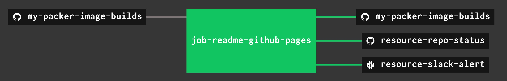

# my-packer-image-builds

[](https://codeclimate.com/github/JeffDeCola/my-packer-image-builds/maintainability)
[](https://codeclimate.com/github/JeffDeCola/my-packer-image-builds/issues)
[](http://jeffdecola.mit-license.org)

`my-packer-image-builds` _is a place for me to create images via packer._

There will be no explanation on how this is done, refer to my
[packer cheat sheet](https://github.com/JeffDeCola/my-cheat-sheets/tree/master/software/operations-tools/orchestration/builds-deployment-containers/packer-cheat-sheet).

[GitHub Webpage](https://jeffdecola.github.io/my-packer-image-builds/).

* [GCE]()
  * jeffs-gce-ubuntu-1804
* [VAGRANT]()
  * jeffs-ubuntu-1804-virtualbox-vm-box

## GCE

My packer builds at Google Computer Engine.

### jeffs-gce-ubuntu-1804

Configuration,

* tdb
* tbd

To build

```bash
sh build.sh
```

To ssh onto running docker container,

```bash
docker exec -i -t jeffs-ubuntu-container /bin/bash
vagrant docker-exec -it -- /bin/sh
```

## VAGRANT

My packer builds for vagrant.

### jeffs-ubuntu-1804-virtualbox-vm-box

Configuration,

* Goal - Create a vagrant box of ubuntu 18.04
* Using
  `iso/ubuntu-18.04.2-server-amd64.iso`
  ubuntu 18.04 .iso file.
* [Packer template file](https://github.com/JeffDeCola/my-packer-image-builds/blob/master/jeffs-ubuntu-1804-virtualbox-vm-box/vagrant-packer-template.json)
  to manage/configure this development environment

This build is located in my repo
[my-vagrant-boxes](https://github.com/JeffDeCola/my-vagrant-boxes#jeffs-ubuntu-1804-virtualbox-vm-box).

## UPDATE GITHUB WEBPAGE USING CONCOURSE (OPTIONAL)

For fun, I use concourse to update
[my-packer-image-builds GitHub Webpage](https://jeffdecola.github.io/my-packer-image-builds/)
and alert me of the changes via repo status and slack.

A pipeline file [pipeline.yml](https://github.com/JeffDeCola/my-packer-image-builds/tree/master/ci/pipeline.yml)
shows the entire ci flow. Visually, it looks like,



The `jobs` and `tasks` are,

* `job-readme-github-pages` runs task
  [readme-github-pages.sh](https://github.com/JeffDeCola/my-packer-image-builds/tree/master/ci/scripts/readme-github-pages.sh).

The concourse `resources types` are,

* `my-packer-image-builds` uses a resource type
  [docker-image](https://hub.docker.com/r/concourse/git-resource/)
  to PULL a repo from github.
* `resource-slack-alert` uses a resource type
  [docker image](https://hub.docker.com/r/cfcommunity/slack-notification-resource)
  that will notify slack on your progress.
* `resource-repo-status` uses a resource type
  [docker image](https://hub.docker.com/r/dpb587/github-status-resource)
  that will update your git status for that particular commit.

For more information on using concourse for continuous integration,
refer to my cheat sheet on [concourse](https://github.com/JeffDeCola/my-cheat-sheets/tree/master/software/operations-tools/continuous-integration-continuous-deployment/concourse-cheat-sheet).
