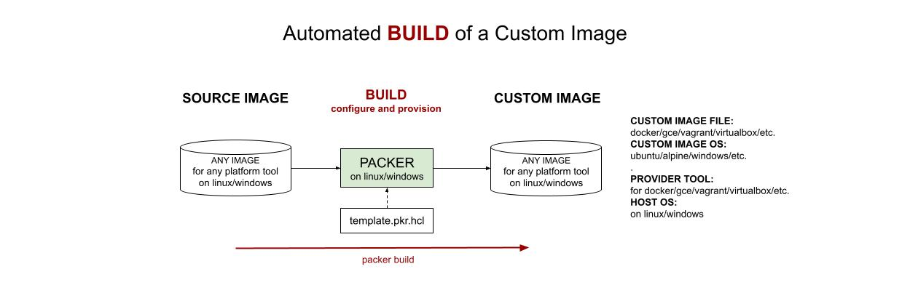

# MY PACKER IMAGE BUILDS

[](https://codeclimate.com/github/JeffDeCola/my-packer-image-builds/issues)
[](http://jeffdecola.mit-license.org)
[](https://jeffdecola.com)

_A place to keep my packer image builds._

tl;dr,

```bash
## BUILD IMAGE
packer build template.pkr.hcl

## OTHER COMMANDS
packer validate template.pkr.hcl
```

Table of Contents

* [OVERVIEW](https://github.com/JeffDeCola/my-packer-image-builds#overview)
* [DOCKER IMAGES](https://github.com/JeffDeCola/my-packer-image-builds#docker-images)
* [GOOGLE COMPUTE ENGINE (GCE) IMAGES](https://github.com/JeffDeCola/my-packer-image-builds#google-compute-engine-gce-images)
* [VAGRANT IMAGES (BOX)](https://github.com/JeffDeCola/my-packer-image-builds#vagrant-images-box)
* [VIRTUALBOX IMAGES](https://github.com/JeffDeCola/my-packer-image-builds#virtualbox-images)

Documentation and Reference

* My
  [packer cheat sheet](https://github.com/JeffDeCola/my-cheat-sheets/tree/master/software/operations/orchestration/builds-deployment-containers/packer-cheat-sheet)
* An illustration of how
  [vagrant, docker and packer](https://github.com/JeffDeCola/my-cheat-sheets/tree/master/software/operations/orchestration/builds-deployment-containers/packer-cheat-sheet#vagrant-docker-and-packer)
  build and deploy images  
* This repos
  [github webpage](https://jeffdecola.github.io/my-packer-image-builds/)
  _built with
  [concourse](https://github.com/JeffDeCola/my-packer-image-builds/blob/master/ci-README.md)_

## OVERVIEW

Packer is useful for the automated **BUILD** of a custom image.



These builds use the following statement,

**Using packer to build a/an {CUSTOM IMAGE FILE} image
containing the {CUSTOM IMAGE OS} OS
for {PROVIDER TOOL} on {HOST OS}.**

Where,

* **CUSTOM IMAGE FILE**: docker/gce/vagrant/virtualbox/etc.
* **CUSTOM IMAGE OS**: ubuntu/alpine/windows/etc.
* **PROVIDER TOOL**: docker/gce/virtualbox/etc.
* **HOST OS**: linux/windows

## DOCKER IMAGES

_You can also build docker images using a Dockerfile as shown in
[my-docker-image-builds](https://github.com/JeffDeCola/my-docker-image-builds)._

* [jeffs-docker-image-alpine](https://github.com/JeffDeCola/my-packer-image-builds/tree/master/docker-images/jeffs-docker-image-alpine)

  _Using packer to build a docker image
  containing the alpine OS
  for docker on linux._
  
* [jeffs-docker-image-ubuntu-2204](https://github.com/JeffDeCola/my-packer-image-builds/tree/master/docker-images/jeffs-docker-image-ubuntu-2204)

  _Using packer to build a docker image
  containing the ubuntu 22.04 OS
  for docker on linux._

## GOOGLE COMPUTE ENGINE (GCE) IMAGES

_You can also build gce images using gcloud cli or the gce gui._

* [jeffs-gce-image-ubuntu-2204](https://github.com/JeffDeCola/my-packer-image-builds/tree/master/google-compute-engine-images/jeffs-gce-image-ubuntu-2204)

  _Using packer to remotely build a gce image
  containing the ubuntu 22.04 OS
  for gce on linux._

## VAGRANT IMAGES (BOX)

* [jeffs-vagrant-image-ubuntu-2204-for-virtualbox](https://github.com/JeffDeCola/my-packer-image-builds/tree/master/vagrant-images/jeffs-vagrant-image-ubuntu-2204-for-virtualbox)

  _Using packer to build a vagrant image (box)
  containing the ubuntu 22.04 OS
  for virtualbox on linux or windows._

## VIRTUALBOX IMAGES

_It's nice using packer because you don't have to use the virtualbox gui._

* [jeffs-virtualbox-image-ubuntu-2204-for-virtualbox](https://github.com/JeffDeCola/my-packer-image-builds/tree/master/virtualbox-images/jeffs-virtualbox-image-ubuntu-2204-for-virtualbox)

  _Using packer to build a virtualbox image
  containing the ubuntu 22.04 OS
  for virtualbox on linux or windows._
