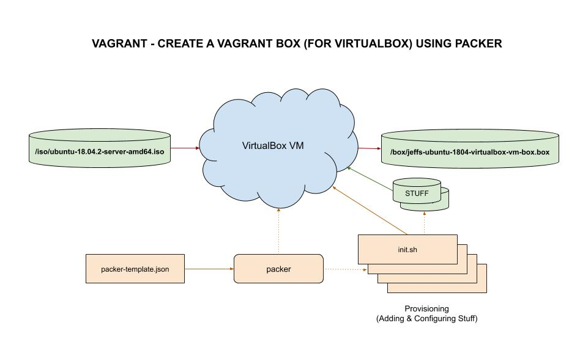

# jeffs-vagrant-image-ubuntu-2204-for-virtualbox-on-linux

[](http://jeffdecola.mit-license.org)
[](https://jeffdecola.com)

_Using packer to build a vagrant image (box)
containing the ubuntu 22.04 OS
for virtualbox on linux._

Table on Contents

* tbd

Documentation and Reference

* My
  [packer cheat sheet](https://github.com/JeffDeCola/my-cheat-sheets/tree/master/software/operations/orchestration/builds-deployment-containers/packer-cheat-sheet)
* My
  [vagrant cheat sheet](https://github.com/JeffDeCola/my-cheat-sheets/tree/master/software/development/development-environments/vagrant-cheat-sheet)

## PACKER TEMPLATE FILE

* _Using packer to build a vagrant image (box)
  containing the ubuntu 22.04 OS
  for virtualbox on linux_
* Packer file:
  [template.pkr.hcl](https://github.com/JeffDeCola/my-packer-image-builds/tree/master/vagrant-images/jeffs-vagrant-image-ubuntu-2204-for-virtualbox-on-linux/template.pkr.hcl)
* Size: ?????
* Configure and provision
  * [init.sh](https://github.com/JeffDeCola/my-vagrant-boxes/blob/master/create-vagrant-box-for-virtualbox-on-windows-using-packer/jeffs-ubuntu-1804-virtualbox-vm-box/install-scripts/init.sh)
    Initial setup
  * [move-welcome-file.sh](https://github.com/JeffDeCola/my-vagrant-boxes/blob/master/create-vagrant-box-for-virtualbox-on-windows-using-packer/jeffs-ubuntu-1804-virtualbox-vm-box/install-scripts/move-welcome-file.sh)
    Move welcome file /home/vagrant
  * [move-vagrant-insecure-public-key.sh](https://github.com/JeffDeCola/my-vagrant-boxes/blob/master/create-vagrant-box-for-virtualbox-on-windows-using-packer/jeffs-ubuntu-1804-virtualbox-vm-box/install-scripts/move-vagrant-insecure-public-key.sh)
    Move vagrant insecure public key to authorized_keys
  * [install-packages.sh](https://github.com/JeffDeCola/my-vagrant-boxes/blob/master/create-vagrant-box-for-virtualbox-on-windows-using-packer/jeffs-ubuntu-1804-virtualbox-vm-box/install-scripts/install-packages.sh)
    Install packages
  * [cleanup.sh](https://github.com/JeffDeCola/my-vagrant-boxes/blob/master/create-vagrant-box-for-virtualbox-on-windows-using-packer/jeffs-ubuntu-1804-virtualbox-vm-box/install-scripts/cleanup.sh)
    Cleanup
* Source Image: iso
  * **"ubuntu-22.04.2-live-server-amd64.iso"** for vagrant on linux
* Custom Image: vagrant
  * ubuntu 22.04 for vagrant on linux
* Contains:
  * ??? golang 1.20.1 ????

## BUILD IMAGE

Get ubuntu .iso file and place in `iso/` folder.

```bash
cd iso/
wget http://releases.ubuntu.com/22.04/ubuntu-22.04.2-live-server-amd64.iso
```

Validate and build on virtualbox linux,

```bash
packer validate template.json
packer build template.json
```

Or use
[build-image.sh](https://github.com/JeffDeCola/my-packer-image-builds/tree/master/google-compute-engine-images/jeffs-vagrant-image-ubuntu-2204-for-virtualbox-on-linux/build-image.sh),

```bash
sh build-image.sh
```

## TEST IMAGE

Now we have the box in `/box/jeffs-ubuntu-1804-virtualbox-vm-box.box`.

Add/list/remove box to/from vagrant,

```bash
vagrant box add --name "ubuntu/jeffs-ubuntu-1804-virtualbox-vm-box" --force jeffs-ubuntu-1804-virtualbox-vm-box.box
vagrant box list
vagrant box remove ubuntu/jeffs-ubuntu-1804-virtualbox-vm-box
```

Use as normal,

```bash
vagrant up
```

## ILLUSTRATION

This may help,


